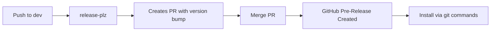
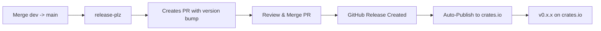

# Dual-Branch Development Workflow

This document describes rappct's automated dual-branch workflow optimized for AI-assisted development and stable releases.

## Branch Strategy

### `dev` Branch (Development / Pre-releases)
- Purpose: Active development, AI agent experimentation, rapid iteration
- Stability: May contain breaking changes, experimental features
- Releases: Automated GitHub pre-releases only (e.g., `dev-v0.12.3`)
- Publishing: GitHub releases only — install via git commands
- Dev GitHub releases are explicitly marked as prereleases
- Protection: None — direct pushes allowed for rapid development

### `main` Branch (Stable / Production)
- Purpose: Production-ready, stable releases only
- Stability: Guaranteed stable, follows semantic versioning strictly
- Releases: Stable releases to crates.io (e.g., `v0.11.2`)
- Publishing: Automatic stable releases only
- Protection: Requires PR review, CI must pass

---

## Complete Automated Workflows

### Dev Branch Workflow (Rapid Iteration)



Steps:
1. Work on dev branch:
   ```bash
   git checkout dev
   # Make changes
   git commit -m "feat: add awesome feature"
   git push origin dev
   ```

2. release-plz runs automatically and creates/updates a PR:
   - Analyzes conventional commits since last release
   - Updates version in `Cargo.toml`
   - Generates changelog in `CHANGELOG-DEV.md`
   - Tag format: `dev-v0.12.3`

3. Merge the release PR (via GitHub UI)

4. Automatic GitHub pre-release:
   - GitHub pre-release created with tag `dev-v0.12.3`
   - Install via: `cargo add rappct --git https://github.com/cpjet64/rappct.git --tag dev-v0.12.3`

### Main Branch Workflow (Stable Releases)



Steps:
1. Create PR from dev -> main:
   ```bash
   # On GitHub: Create Pull Request
   # Base: main, Compare: dev
   ```

2. Merge PR when ready

3. release-plz runs automatically and creates/updates a PR:
   - Analyzes conventional commits since last release
   - Updates version in `Cargo.toml`
   - Generates changelog in `CHANGELOG.md`
   - Tag format: `rappct-v0.12.0`

4. Merge the release PR (via GitHub UI)

5. Automatic publishing:
   - GitHub stable release created
   - Published to crates.io as stable version
   - Example: `rappct = "0.12.0"`

7. Sync main -> dev:
   ```bash
   git checkout dev
   git merge main
   git push origin dev
   ```

---

## Conventional Commits

Both workflows use Conventional Commits to determine version bumps:

| Commit Prefix | Version Bump | Example |
|---------------|--------------|---------|
| feat: | Minor (0.x.0) | feat: add new capability |
| fix: | Patch (0.0.x) | fix: resolve token parsing |
| feat!: or BREAKING CHANGE: | Major (x.0.0) | feat!: remove deprecated API |
| chore:, docs:, style: | No bump | docs: update README |

Examples:
```bash
# Minor version bump (0.11.x -> 0.12.0)
git commit -m "feat: add async support for profile creation"

# Patch version bump (0.11.1 -> 0.11.2)
git commit -m "fix: handle edge case in capability derivation"

# Major version bump (0.11.x -> 1.0.0) - use sparingly
git commit -m "feat!: redesign launch API

BREAKING CHANGE: launch_in_container now requires explicit stdio config"
```

---

## AI Coding Agent Best Practices

### When Working on Dev
1. Commit frequently — each feature gets its own commit
2. Use conventional commits — enables automatic versioning
3. Push to dev directly — no PR needed for rapid iteration
4. Merge release PRs promptly — keep dev releases flowing
5. Test with dev versions — install via git to test your changes

### When Stabilizing to Main
1. Create PR dev -> main — requires human review
2. Wait for CI — must pass all feature combinations
3. Review changelog — ensure release notes are clear
4. Merge release PR — triggers stable publish
5. Sync main -> dev — keep branches in sync

### Avoiding Common Pitfalls
- Don't commit directly to main — always go through dev first
- Don't skip CI — automated checks catch issues early
- Don't ignore failing tests — fix them before releasing
- Don't forget to sync main -> dev — prevents divergence

---

## Branch Protection Rules (Recommended)

### Main Branch
Go to https://github.com/cpjet64/rappct/settings/branches and configure:

- Require pull request before merging
  - Require approvals: 1
  - Dismiss stale reviews when new commits are pushed

- Require status checks to pass before merging
  - Require branches to be up to date
  - Status checks required: test-windows

- Require conversation resolution before merging

- Do not allow bypassing the above settings

### Dev Branch
- No protection — allows direct pushes for rapid development
- CI still runs — automated quality checks

---

## Example Complete Workflow

### Scenario: Add New Feature via AI Agent

Day 1-3: Development
```bash
# Agent works on dev branch
git checkout dev

# Agent implements feature
git commit -m "feat: add capability suggestion fuzzy matching"
git push origin dev

# release-plz creates PR
# Merge PR -> dev-v0.12.3 GitHub pre-release created

# Continue iterating
git commit -m "fix: improve suggestion threshold"
git push origin dev

# release-plz updates PR
# Merge PR -> dev-v0.12.4 GitHub pre-release created

# Test dev version
cargo add rappct --git https://github.com/cpjet64/rappct.git --tag dev-v0.12.4
```

Day 4: Stabilization
```bash
# Human reviews dev work, creates PR dev -> main
# Human merges PR

# release-plz creates stable release PR
# Human reviews changelog, merges PR
# v0.12.0 published to crates.io (stable)

# Sync main back to dev
git checkout dev
git merge main
git push origin dev
```

---

## Troubleshooting

### Release PR Not Created
- Check CI passed: https://github.com/cpjet64/rappct/actions
- Verify conventional commits used (must have feat: or fix:)
- Check for existing release PR (may be updating existing)

### CI Failing
- Run locally: `cargo test --all-targets --all-features`
- Check Clippy: `cargo clippy --all-targets --all-features -- -D warnings`
- Fix warnings — CI treats them as errors

### Publish Failing
- Verify `CARGO_REGISTRY_TOKEN` is set in GitHub Secrets
- Check crates.io for version conflicts
- Ensure Cargo.toml metadata is complete

### Branches Diverged
```bash
# Sync main -> dev
git checkout dev
git merge main
git push origin dev
```

---

## References

- Conventional Commits: https://www.conventionalcommits.org/
- Semantic Versioning: https://semver.org/
- release-plz (Rust-native release automation): https://release-plz.ieni.dev/
- git-cliff (changelog generator): https://git-cliff.org/
- GitHub Actions workflow syntax: https://docs.github.com/en/actions/using-workflows/workflow-syntax-for-github-actions
