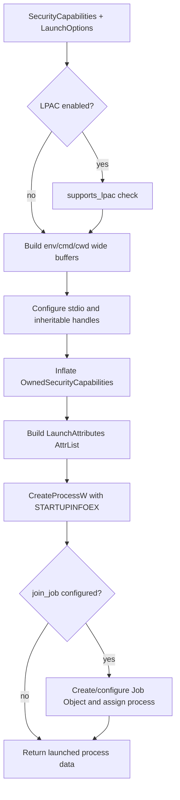

# Architecture

See also: [API Reference](./API.md)

## Scope and Platform

`rappct` is a Windows-focused Rust library for AppContainer/LPAC workflows. The crate exposes a cross-platform API surface, but most operational paths return `AcError::UnsupportedPlatform` on non-Windows hosts.

Feature gates in `Cargo.toml`:

- `net`: enables firewall loopback helpers (`rappct::net`)
- `introspection`: enables diagnostics (`rappct::diag`) and capability name suggestions
- `tracing`: enables tracing points in launch/capability/network paths
- `serde`: enables `Serialize`/`Deserialize` on selected SID/capability types

## Module Boundaries

### Public modules

- `profile`: AppContainer profile lifecycle (`ensure/open/delete`) and profile-derived paths.
- `capability`: capability catalog + SID derivation + `SecurityCapabilitiesBuilder`.
- `launch`: process launch with `STARTUPINFOEX` + security capabilities + optional stdio/job control.
- `token`: current-process token introspection (`is_appcontainer`, `is_lpac`, package/capability SIDs).
- `acl`: DACL grants for files/directories/registry targets.
- `sid`: SID value types (`AppContainerSid`, `SidAndAttributes`).
- `util`: UTF-16 helpers and legacy Win32 RAII wrappers (deprecated wrappers are still exported on Windows).
- `diag` (`feature = "introspection"`): configuration warnings for common misconfiguration patterns.
- `net` (`feature = "net"`): firewall appcontainer enumeration and loopback exemption helpers.

### Internal modules

- `ffi` (`pub(crate)`): ownership-safe wrappers for Win32 allocations/handles/attribute lists (`Handle`, `OwnedSid`, `OwnedSecurityCapabilities`, `AttrList`, etc.).
- `error`: crate error model (`AcError`) and `Result<T>` alias, re-exported at crate root.

## Key Data and Lifetime Flows

## 1) Profile and SID flow

1. `AppContainerProfile::ensure(name, display, desc)` creates profile or derives SID if already present.
2. SID is converted to SDDL and stored as `AppContainerSid`.
3. The same `AppContainerSid` becomes the package SID source for capability building and ACL grants.

Important ownership point: Windows-allocated SID/string memory is wrapped with crate RAII guards (`OwnedSid`, `LocalAllocGuard`, `CoTaskMem`) and converted to owned Rust types before returning.

## 2) Capability derivation flow

1. `SecurityCapabilitiesBuilder` accumulates friendly capability names (`with_known`, `with_named`, `with_lpac_defaults`, or `from_use_case`).
2. `build()` calls `derive_named_capability_sids()`.
3. On Windows, each name is resolved through `DeriveCapabilitySidsFromName`; output SIDs become `SidAndAttributes` entries.
4. Result is `SecurityCapabilities { package, caps, lpac }`.

Lifetime note: launch path later inflates this high-level structure into `OwnedSecurityCapabilities` so raw SID pointers stay valid for process creation.

## 3) Launch path and lifetime constraints

`launch::launch_in_container` and `launch::launch_in_container_with_io` are thin entry points over `launch_impl` (Windows).

Critical lifetime invariants enforced in code:

- `LaunchAttributes` owns `OwnedSecurityCapabilities`, optional LPAC policy buffer, and copied handle list so pointer-backed attribute entries remain valid through `CreateProcessW`.
- `StartUpInfoExGuard` keeps attribute-list memory attached to `STARTUPINFOEXW` until launch completes.
- `InheritList` owns duplicated inheritable handles for child startup and drops them after process creation.
- For `StdioConfig::Pipe`, parent endpoints are returned as `std::fs::File`; child endpoints remain in inherited handle list only for launch.

## 4) Optional job-object control flow

When `LaunchOptions::join_job` is set:

1. A job is created.
2. Optional memory and CPU limits are applied.
3. Child process is attached.
4. If `kill_on_job_close = true`, a `JobGuard` retains the job handle in `LaunchedIo`; drop closes job and enforces kill-on-close behavior.

## 5) Network loopback safety latch flow (`feature = "net"`)

- `add_loopback_exemption` requires a `LoopbackAdd` that has called `confirm_debug_only()` first.
- Confirmation toggles a one-shot atomic latch (`CONFIRM_NEXT`).
- Without confirmation, call fails with `AcError::AccessDenied`.
- `LoopbackExemptionGuard` composes this API and auto-removes exemption in `Drop` unless disabled.

## Error Model

All public operations return `Result<T> = std::result::Result<T, AcError>`.

Notable variants used as control-flow boundaries:

- `UnsupportedPlatform`: non-Windows execution paths.
- `UnsupportedLpac`: LPAC requested but OS support check failed.
- `UnknownCapability`: capability resolution failed; optional suggestion (with `introspection`).
- `LaunchFailed`: stage/hint/source context for process creation pipeline failures.
- `ResourceNotFound`: ACL target precheck failure before Win32 ACL calls.

## Public Re-export Surface

Crate root (`lib.rs`) re-exports common types/functions for streamlined usage:

- `AppContainerProfile`, `derive_sid_from_name`, `AppContainerSid`
- Capability types/builders (`CapabilityName`/`KnownCapability`, `SecurityCapabilitiesBuilder`, etc.)
- Launch types (`LaunchOptions`, `StdioConfig`, `JobLimits`, `Launched`, `launch_in_container`)
- On Windows only: `LaunchedIo`, `launch_in_container_with_io`

For complete API listings and examples, see [API Reference](./API.md).
