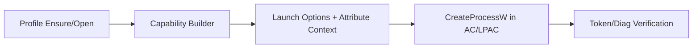

# rappct Documentation

`rappct` is a Rust toolkit for creating and launching Windows AppContainer (AC) and Low Privilege AppContainer (LPAC) workloads with predictable security boundaries.

This page is the high-level entry point for the project documentation set.

## Purpose

Use `rappct` when you need to:

- Create or open AppContainer profiles.
- Compose capability SIDs (including LPAC defaults when appropriate).
- Launch processes inside AC/LPAC with controlled stdio and optional job constraints.
- Introspect runtime token/container state.
- Apply ACL grants for package/capability SIDs.

## Quick Start

### 1. Add the crate

```toml
[dependencies]
rappct = "0.13"
```

### 2. Build and test

```powershell
cargo build
cargo test --all-targets
```

### 3. Run a smoke example (Windows host)

```powershell
cargo run --example comprehensive_demo
```

For optional modules, enable features explicitly:

```powershell
cargo test --all-targets --features net,introspection
```

## Platform and Feature Matrix

| Area | Status | Notes |
| --- | --- | --- |
| Host platform | Windows-first | Non-Windows builds keep API surface but return `UnsupportedPlatform` at runtime for Windows-only operations. |
| Rust edition | 2024 | See `Cargo.toml` (`edition = "2024"`). |
| `net` feature | Optional | Enables firewall loopback exemption helpers; debug/testing use only. |
| `introspection` feature | Optional | Enables diagnostics and capability suggestion helpers. |
| `tracing` feature | Optional | Enables structured telemetry hooks through `tracing`. |
| `serde` feature | Optional | Enables serde derive support for shared model types. |

## Top Workflows

### Local quality gates

```powershell
cargo fmt --all -- --check
cargo clippy --all-targets --all-features -- -D warnings
cargo test --all-targets
```

### Full local CI equivalent

```powershell
just ci-deep
```

### API docs generation

```powershell
$env:RUSTFLAGS='-D warnings'; cargo doc --no-deps --all-features
```

### Runtime flow (conceptual)



## Documentation Map

- [Specification](./SPEC.md)
- [Architecture](./ARCHITECTURE.md)
- [API Guide](./API.md)
- [Tooling and CI](./TOOLING.md)
- [Docs Index](./index.md)
- [Progress Tracker](./PROGRESS.md)

## Module Entry Points

- [Crate root exports](../src/lib.rs)
- [AppContainer profile lifecycle](../src/profile.rs)
- [Capability derivation and builder](../src/capability.rs)
- [Launch pipeline](../src/launch/mod.rs)
- [Launch attribute internals](../src/launch/attr.rs)
- [Token introspection](../src/token.rs)
- [ACL grant helpers](../src/acl.rs)
- [SID models](../src/sid.rs)
- [Network loopback helpers (`net`)](../src/net.rs)
- [Diagnostics (`introspection`)](../src/diag.rs)
- [FFI safety wrappers](../src/ffi)

## Legacy Documentation Note

Previous root/docs materials were archived under [`legacy/docs`](../legacy/docs/) during the documentation refresh. Use that folder for historical references while the new docs set is being finalized.
