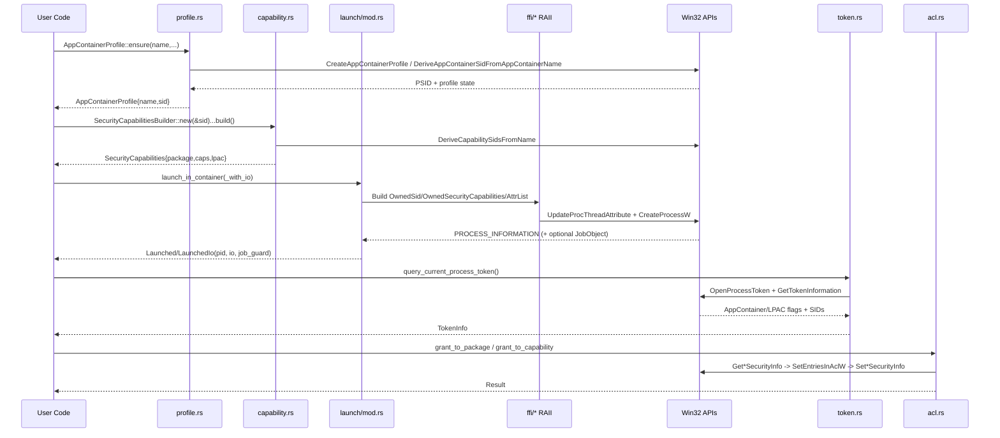

# SPEC.md

## Project Overview
`rappct` is a Windows-first Rust library for creating and running processes inside AppContainer and LPAC (Low Privilege AppContainer) boundaries, plus supporting capability derivation, ACL grants, token introspection, diagnostics, and optional network loopback management.

Current crate metadata and compatibility:
- Crate: `rappct` (`Cargo.toml`)
- Edition: Rust 2024
- `rust-version`: `1.88`
- Platform behavior: public APIs compile cross-platform, but runtime operations that require Windows return `AcError::UnsupportedPlatform` on non-Windows hosts.
- LPAC gate: `supports_lpac()` requires Windows 10 build 15063+ (1703) unless test override `RAPPCT_TEST_LPAC_STATUS=ok|unsupported` is set.

Feature flags:
- `net`: enables firewall/network-isolation integration (`src/net.rs`) including appcontainer enumeration and loopback exemption APIs.
- `introspection`: enables configuration diagnostics and capability-name suggestion paths (`src/diag.rs`, suggestion logic in `src/capability.rs`).
- `tracing`: emits launch/capability trace logs on instrumented paths.
- `serde`: derives serialization for `SecurityCapabilities`, `AppContainerSid`, `SidAndAttributes`.

LPAC policy in this codebase:
- LPAC is opt-in (`SecurityCapabilitiesBuilder::lpac(true)` and typically `.with_lpac_defaults()`).
- LPAC defaults added by builder are `registryRead` and `lpacCom`.
- Launch path enforces LPAC support by calling `supports_lpac()` before process creation.
- Diagnostics warn when LPAC mode is requested without common LPAC defaults.

## Architecture Overview (with Mermaid diagram)
The crate is organized around a layered architecture:
1. Public API + feature-gated modules (`src/lib.rs`)
2. Domain modules (`profile`, `capability`, `launch`, `token`, `acl`, optional `net`/`diag`)
3. Internal FFI RAII layer (`src/ffi/*`) that owns Win32 resources and lifetime boundaries
4. Windows APIs (`Userenv`, `Advapi32`, `Kernel32`, `ntdll`, firewall APIs) accessed through `windows` crate and explicit extern bindings

```mermaid
flowchart TD
    A[Consumer Code / Examples / Tests] --> B[src/lib.rs re-exports]

    B --> C[profile.rs]
    B --> D[capability.rs]
    B --> E[launch/mod.rs]
    B --> F[token.rs]
    B --> G[acl.rs]
    B --> H[diag.rs (feature=introspection)]
    B --> I[net.rs (feature=net)]

    C --> J[src/ffi/* RAII wrappers]
    D --> J
    E --> J
    F --> J
    G --> J
    I --> J

    J --> K[Userenv.dll]
    J --> L[Advapi32.dll]
    J --> M[Kernel32.dll]
    J --> N[ntdll.dll]
    J --> O[Windows Firewall APIs]

    E --> P[CreateProcessW + STARTUPINFOEX]
    D --> Q[SECURITY_CAPABILITIES]
    C --> R[AppContainer profile + SID lifecycle]
```

## Components & Modules
### `src/lib.rs`
- Defines module boundaries and feature gating.
- Re-exports primary types/functions for consumers.
- Implements `supports_lpac()` with `RtlGetVersion` and test override env var.

### `src/profile.rs`
- `AppContainerProfile::ensure/open/delete` for profile lifecycle.
- SID derivation and identity operations (`derive_sid_from_name`).
- Path resolution APIs:
  - `folder_path()` via `GetAppContainerFolderPath` with fallback to `%LOCALAPPDATA%\\Packages\\<SID>`.
  - `named_object_path()` via `GetAppContainerNamedObjectPath`.

### `src/capability.rs`
- Capability catalog (`CapabilityName`, `CapabilityCatalog`, `Capability`).
- SID derivation path via `DeriveCapabilitySidsFromName`.
- `SecurityCapabilitiesBuilder` for building launch-ready capability sets.
- Use-case presets (`UseCase`) for common capability groupings.
- Introspection suggestion path for unknown capability names when `introspection` is enabled.

### `src/launch/mod.rs` + `src/launch/env.rs`
- Launch APIs:
  - `launch_in_container`
  - `launch_in_container_with_io` (Windows)
- Uses `STARTUPINFOEX` and process thread attributes.
- Supports stdio modes: `Inherit`, `Null`, `Pipe`.
- Supports optional job-object limits (`JobLimits`: memory, CPU cap, kill-on-close).
- Supports custom environment block creation/merging via sorted UTF-16 wide blocks.
- Returns `Launched` or `LaunchedIo` with `wait(timeout)` support.

### `src/token.rs`
- `query_current_process_token()` extracts:
  - AppContainer/LPAC booleans
  - package SID
  - token capability SID list

### `src/acl.rs`
- ACL grant helpers:
  - `grant_to_package`
  - `grant_to_capability`
- Resource targets: file, directory (with inheritance control), registry key.
- Registry root support is explicitly constrained to HKCU/HKLM forms.

### `src/net.rs` (`feature = "net"`)
- Network isolation helpers:
  - `list_appcontainers`
  - `add_loopback_exemption`
  - `remove_loopback_exemption`
  - `LoopbackExemptionGuard` (RAII add/remove)
- Explicit safety latch: `LoopbackAdd(...).confirm_debug_only()` required before add.

### `src/diag.rs` (`feature = "introspection"`)
- `validate_configuration` emits `ConfigWarning` values for:
  - LPAC without common defaults
  - missing network capabilities

### `src/ffi/*` (internal safety core)
- `handles.rs`: owned Win32 handles, duplication, file conversion.
- `mem.rs`: `LocalAllocGuard` and `CoTaskMem` deallocators.
- `sid.rs`: `OwnedSid` with allocator-aware drop strategy (`LocalFree` vs `FreeSid`).
- `sec_caps.rs`: owned `SECURITY_CAPABILITIES` graph that keeps SID memory alive.
- `attr_list.rs`: owned `PROC_THREAD_ATTRIBUTE_LIST` and attribute setters.
- `wstr.rs`: owned wide-string helpers for stable FFI pointers.

### Tests, Examples, Scripts, Workflows
- `tests/`: Windows-heavy integration and API surface validation.
- `examples/`: end-to-end demos (`acrun`, `network_demo`, `comprehensive_demo`, `advanced_features`, `rappct_demo`).
- `scripts/`: local CI orchestration and policy checks.
- `.github/workflows/`: hosted CI matrix, CodeQL, and release automation.

## Data Models & Flows (Mermaid)
Key data models:
- `AppContainerProfile { name, sid }`
- `AppContainerSid` (validated or unchecked SDDL wrapper)
- `SidAndAttributes { sid_sddl, attributes }`
- `SecurityCapabilities { package, caps, lpac }`
- `LaunchOptions`, `JobLimits`, `Launched`, `LaunchedIo`
- `TokenInfo { is_appcontainer, is_lpac, package_sid, capability_sids }`

Core runtime flow across profile/capability/launch/token/acl:



FFI RAII safety model applied in these flows:
- All raw pointers returned from Win32 allocation APIs are wrapped immediately in allocator-specific guards.
- Drop logic is centralized in FFI wrappers, not call sites.
- Launch attribute memory and SID backing storage are intentionally retained until `CreateProcessW` returns.

## APIs & Interfaces
Primary public interfaces exported from crate root:

Profile and SID:
- `AppContainerProfile::ensure/open/delete/folder_path/named_object_path`
- `derive_sid_from_name`
- `AppContainerSid::{from_sddl, try_from_sddl, as_string}`

Capabilities and launch policy:
- `CapabilityName` / `KnownCapability`
- `CapabilityCatalog`, `Capability`
- `derive_named_capability_sids`
- `SecurityCapabilitiesBuilder::{with_known, with_named, with_lpac_defaults, lpac, from_use_case, build}`
- `supports_lpac`

Launch:
- `launch_in_container`
- `launch_in_container_with_io` (Windows)
- `LaunchOptions`, `JobLimits`, `StdioConfig`
- `LaunchedIo::wait`
- `launch::merge_parent_env`

Token and ACL:
- `token::query_current_process_token`
- `acl::{grant_to_package, grant_to_capability, ResourcePath, AccessMask, AceInheritance}`

Feature-gated interfaces:
- `diag::validate_configuration`, `diag::ConfigWarning` (`introspection`)
- `net::{list_appcontainers, add_loopback_exemption, remove_loopback_exemption, LoopbackAdd, LoopbackExemptionGuard}` (`net`)

Observed interface validation in tests:
- `tests/api_surface.rs` verifies re-exports and type-level accessibility.
- `tests/windows_launch.rs`, `tests/windows_core.rs`, `tests/windows_profile.rs`, `tests/windows_acl.rs`, and `tests/windows_net*.rs` validate runtime behavior on Windows.

## Non-Functional Requirements
Security and safety:
- Resource ownership must remain explicit and allocator-correct across FFI boundaries.
- No silent LPAC escalation: LPAC launch path is gated by support checks and explicit builder intent.
- Loopback firewall mutation in `net` is debug-intent gated through `confirm_debug_only`.

Reliability:
- Error paths return typed `AcError` variants with stage/hint context for launch and access failures.
- Non-Windows behavior fails closed with `UnsupportedPlatform`.
- Environment replacement hazards are mitigated by `merge_parent_env` guidance and helper API.

Quality governance:
- Local mandatory checks include format, lint, tests, and (for deep runs) security/docs/coverage paths.
- CI additionally validates across feature matrix and multiple toolchains.
- Tests include opt-in ignored cases for globally mutating operations (loopback/job semantics).

Compatibility and maintainability:
- Public API remains stable through re-exports and compatibility aliases (`KnownCapability`, `WELL_KNOWN_CAPABILITY_NAMES`, builder `.unwrap()` no-op compatibility method).
- Feature-gated modules allow minimal default surface while supporting extended diagnostics/network behavior.

## Deployment & Setup
Windows-first local setup:
1. Install Rust toolchain with `rustfmt` and `clippy`.
2. Build: `cargo build` (or `cargo build --all-features`).
3. Run tests: `cargo test --all-targets` and feature variants as needed.

Local governance commands:
- `just ci-fast`: pre-commit oriented gate (`hygiene`, `fmt`, `lint`, `build`, `test-quick`, `coverage`).
- `just ci-deep`: pre-push/full gate (`ci-fast` + full tests, security checks, docs).
- Local matrix helper: `scripts/ci-local.ps1` (stable + MSRV toolchains and feature combinations).

Hosted CI governance differences:
- `.github/workflows/ci.yml` runs on `windows-latest` with Rust matrix (`stable`, `1.88.0`..`1.93.0`, `beta`, `nightly`) and feature matrix (`""`, `introspection`, `net`, `introspection,net`).
- Hosted CI enforces fmt/clippy/tests/cargo tree duplicate check but does not run the full local deep stack (`cargo deny`, `cargo audit`, advisory policy script, docs, coverage) in that same workflow.
- `.github/workflows/codeql.yml` adds GitHub CodeQL analysis (actions + rust categories).
- `.github/workflows/release.yml` automates release on `main` via `release-plz`.

Operational notes:
- Loopback exemption tests and some job/process behavior tests are opt-in via env vars (`RAPPCT_ALLOW_NET_TESTS`, `RAPPCT_ALLOW_JOB_TESTS`, `RAPPCT_ITESTS`).
- `net` feature operations can mutate machine-level firewall loopback config and should be treated as development/test-only operations.

## Glossary
- AppContainer: Windows process isolation boundary with capability-scoped access.
- LPAC: Less Privileged AppContainer mode with stricter policy baseline.
- Capability SID: SID derived from capability name and used in token/app security capability sets.
- Package SID: SID representing an AppContainer profile identity.
- `SECURITY_CAPABILITIES`: Win32 struct attached to process creation attributes to define package SID + capabilities.
- `STARTUPINFOEX` / `PROC_THREAD_ATTRIBUTE_LIST`: Extended process creation metadata used to pass security capabilities and related attributes.
- RAII: Resource Acquisition Is Initialization; ownership wrappers that release Win32 resources automatically on drop.
- Loopback exemption: Firewall configuration allowing AppContainer localhost access.

## References
- `Cargo.toml`
- `src/lib.rs`
- `src/error.rs`
- `src/profile.rs`
- `src/capability.rs`
- `src/launch/mod.rs`
- `src/launch/env.rs`
- `src/token.rs`
- `src/acl.rs`
- `src/net.rs`
- `src/diag.rs`
- `src/ffi/mod.rs`
- `src/ffi/handles.rs`
- `src/ffi/mem.rs`
- `src/ffi/sid.rs`
- `src/ffi/sec_caps.rs`
- `src/ffi/attr_list.rs`
- `src/ffi/wstr.rs`
- `tests/api_surface.rs`
- `tests/windows_core.rs`
- `tests/windows_profile.rs`
- `tests/windows_launch.rs`
- `tests/windows_acl.rs`
- `tests/windows_diag.rs`
- `tests/windows_net.rs`
- `tests/windows_net_loopback_guard.rs`
- `tests/windows_job_guard.rs`
- `tests/cap_smoke.rs`
- `examples/acrun.rs`
- `examples/network_demo.rs`
- `examples/comprehensive_demo.rs`
- `examples/advanced_features.rs`
- `examples/rappct_demo.rs`
- `scripts/ci.ps1`
- `scripts/ci-local.ps1`
- `scripts/hygiene.ps1`
- `scripts/enforce_advisory_policy.py`
- `Justfile`
- `.github/workflows/ci.yml`
- `.github/workflows/codeql.yml`
- `.github/workflows/release.yml`
