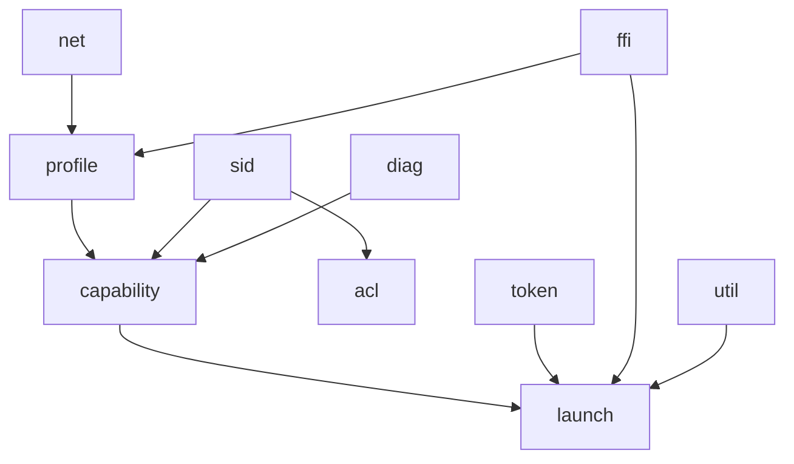

# Module Documentation

This section summarizes crate modules and how they fit together.

## Navigation

- [Documentation Index](../index.md)
- [Tooling and Regeneration](../TOOLING.md)

## Module Pages

- [Profile Module](./profile.md)
- [Capability Module](./capability.md)
- [Launch Module](./launch.md)
- [ACL Module](./acl.md)
- [Token and SID Modules](./token-sid.md)
- [Diagnostics and Network Modules](./diag-net.md)
- [FFI and Utility Modules](./ffi-util.md)

## Dependency View

